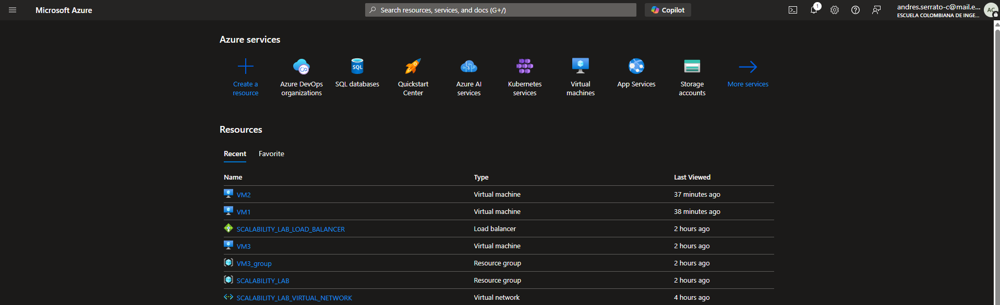
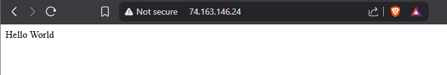
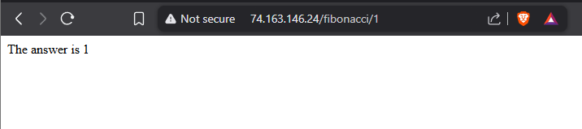
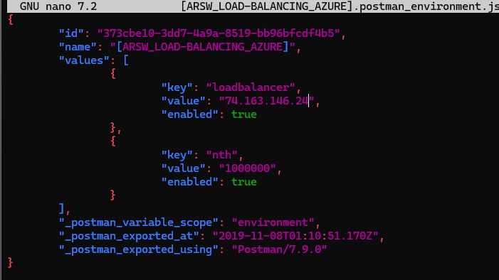
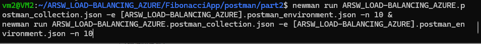
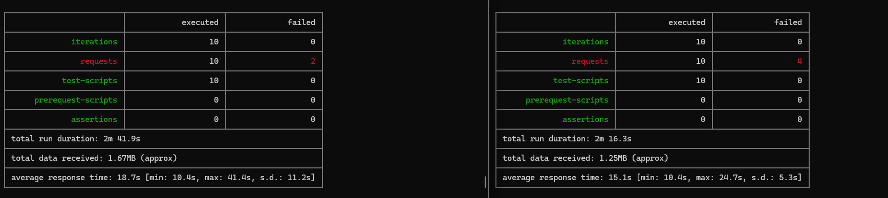
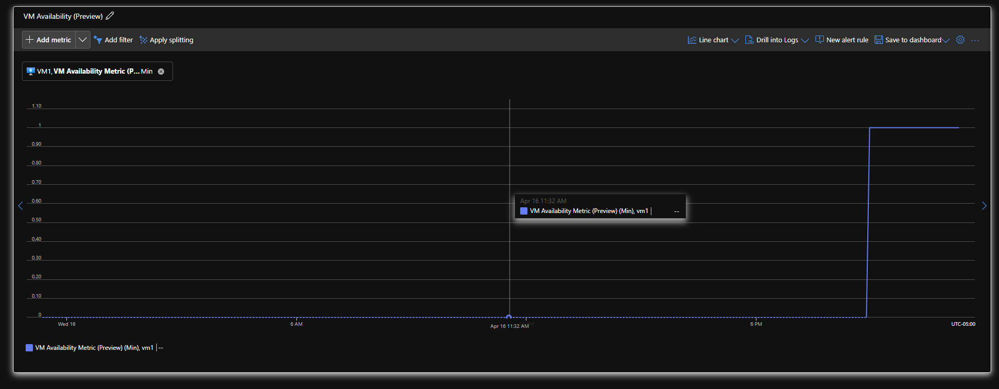
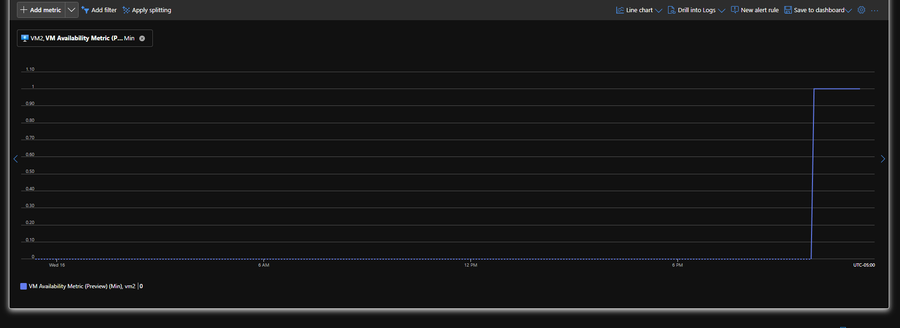
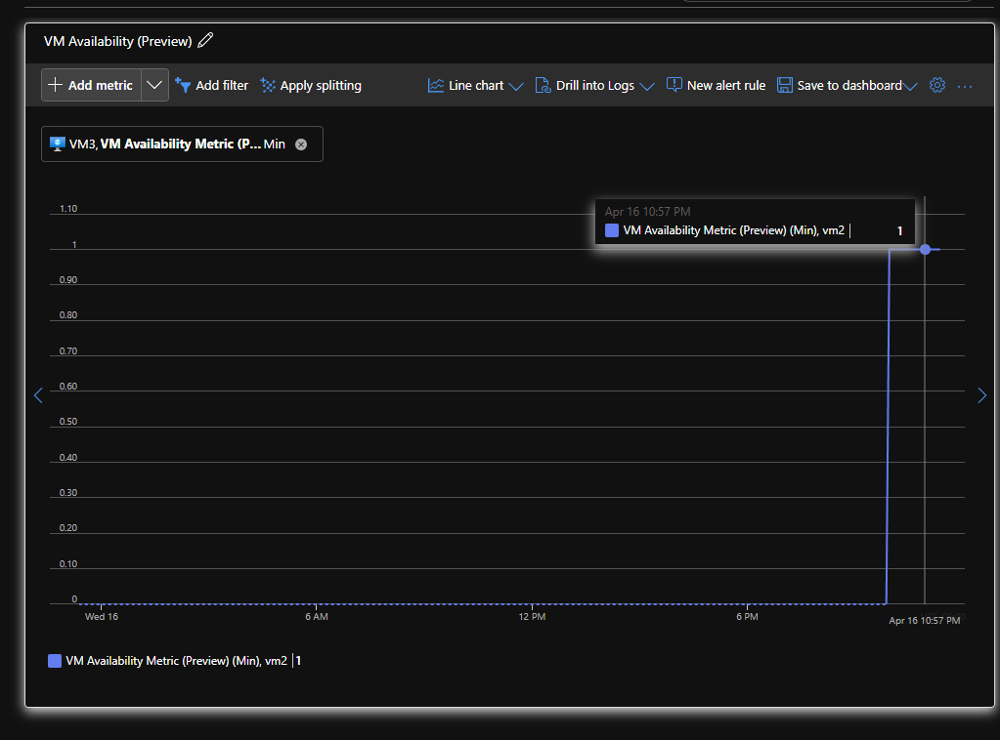
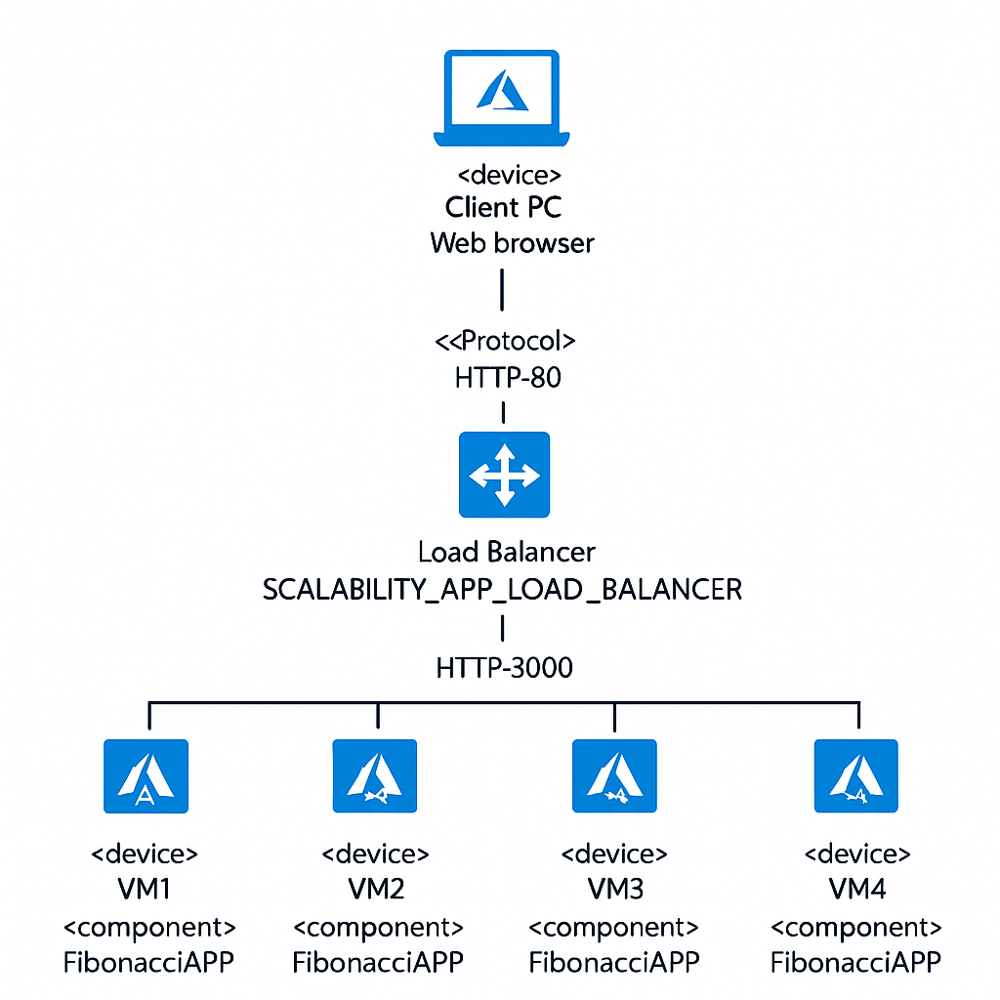

### Escuela Colombiana de Ingeniería

## Andres Serrato camero

## Andrea Valentina Torres Tobar


### Arquitecturas de Software - ARSW

## Escalamiento en Azure con Maquinas Virtuales, Sacale Sets y Service Plans

### Dependencias
* Cree una cuenta gratuita dentro de Azure. Para hacerlo puede guiarse de esta [documentación](https://azure.microsoft.com/es-es/free/students/). Al hacerlo usted contará con $100 USD para gastar durante 12 meses.

### Parte 0 - Entendiendo el escenario de calidad

Adjunto a este laboratorio usted podrá encontrar una aplicación totalmente desarrollada que tiene como objetivo calcular el enésimo valor de la secuencia de Fibonnaci.

**Escalabilidad**
Cuando un conjunto de usuarios consulta un enésimo número (superior a 1000000) de la secuencia de Fibonacci de forma concurrente y el sistema se encuentra bajo condiciones normales de operación, todas las peticiones deben ser respondidas y el consumo de CPU del sistema no puede superar el 70%.

### Parte 1 - Escalabilidad vertical

1. Diríjase a el [Portal de Azure](https://portal.azure.com/) y a continuación cree una maquina virtual con las características básicas descritas en la imágen 1 y que corresponden a las siguientes:
    * Resource Group = SCALABILITY_LAB
    * Virtual machine name = VERTICAL-SCALABILITY
    * Image = Ubuntu Server 
    * Size = Standard B1ls
    * Username = scalability_lab
    * SSH publi key = Su llave ssh publica


2. Para conectarse a la VM use el siguiente comando, donde las `x` las debe remplazar por la IP de su propia VM (Revise la sección "Connect" de la virtual machine creada para tener una guía más detallada).

    `ssh scalability_lab@xxx.xxx.xxx.xxx`

   


4. Instale node, para ello siga la sección *Installing Node.js and npm using NVM* que encontrará en este [enlace](https://linuxize.com/post/how-to-install-node-js-on-ubuntu-18.04/).


   
6. Para instalar la aplicación adjunta al Laboratorio, suba la carpeta `FibonacciApp` a un repositorio al cual tenga acceso y ejecute estos comandos dentro de la VM:

    `git clone <your_repo>`

    `cd <your_repo>/FibonacciApp`

    `npm install`


7. Para ejecutar la aplicación puede usar el comando `npm FibinacciApp.js`, sin embargo una vez pierda la conexión ssh la aplicación dejará de funcionar. Para evitar ese compartamiento usaremos *forever*. Ejecute los siguientes comando dentro de la VM.

    ` node FibonacciApp.js`

8. Antes de verificar si el endpoint funciona, en Azure vaya a la sección de *Networking* y cree una *Inbound port rule* tal como se muestra en la imágen. Para verificar que la aplicación funciona, use un browser y user el endpoint `http://xxx.xxx.xxx.xxx:3000/fibonacci/6`. La respuesta debe ser `The answer is 8`.


10. La función que calcula en enésimo número de la secuencia de Fibonacci está muy mal construido y consume bastante CPU para obtener la respuesta. Usando la consola del Browser documente los tiempos de respuesta para dicho endpoint usando los siguintes valores:
    * 1000000


    * 1010000


    * 1020000


    * 1030000


    * 1040000
    * 1050000


    * 1060000


    * 1070000


    * 1080000


    * 1090000
  


8. Dírijase ahora a Azure y verifique el consumo de CPU para la VM. (Los resultados pueden tardar 5 minutos en aparecer).

9. Ahora usaremos Postman para simular una carga concurrente a nuestro sistema. Siga estos pasos.
    * Instale newman con el comando `npm install newman -g`. Para conocer más de Newman consulte el siguiente [enlace](https://learning.getpostman.com/docs/postman/collection-runs/command-line-integration-with-newman/).
    * Diríjase hasta la ruta `FibonacciApp/postman` en una maquina diferente a la VM.
    * Para el archivo `[ARSW_LOAD-BALANCING_AZURE].postman_environment.json` cambie el valor del parámetro `VM1` para que coincida con la IP de su VM.
    * Ejecute el siguiente comando.

    ```
    newman run ARSW_LOAD-BALANCING_AZURE.postman_collection.json -e [ARSW_LOAD-BALANCING_AZURE].postman_environment.json -n 10 &
    newman run ARSW_LOAD-BALANCING_AZURE.postman_collection.json -e [ARSW_LOAD-BALANCING_AZURE].postman_environment.json -n 10
    ```
10. La cantidad de CPU consumida es bastante grande y un conjunto considerable de peticiones concurrentes pueden hacer fallar nuestro servicio. Para solucionarlo usaremos una estrategia de Escalamiento Vertical. En Azure diríjase a la sección *size* y a continuación seleccione el tamaño `B2ms`.
11. Una vez el cambio se vea reflejado, repita el paso 7, 8 y 9.
12. Evalue el escenario de calidad asociado al requerimiento no funcional de escalabilidad y concluya si usando este modelo de escalabilidad logramos cumplirlo.
14. Vuelva a dejar la VM en el tamaño inicial para evitar cobros adicionales.


**Preguntas**

1. ¿Cuántos y cuáles recursos crea Azure junto con la VM?

Azure crea automáticamente varios recursos al crear una VM. Generalmente incluye:

- Máquina Virtual (VM)

- Grupo de recursos (SCALABILITY_LAB)

- Red virtual (Virtual Network)

- Interfaz de red (Network Interface)

- Disco del sistema operativo (OS Disk)

- Grupo de seguridad de red (NSG - Network Security Group)

- Dirección IP pública

2. ¿Brevemente describa para qué sirve cada recurso?

- **VM:** Ejecuta el sistema operativo y la aplicación.

- **Grupo de recursos:** Agrupa y administra recursos relacionados.

- **Red virtual:** Permite la comunicación de red entre recursos de Azure.

- **Interfaz de red (NIC):** Conecta la VM a la red virtual.

- **Disco del sistema operativo:** Almacena el SO y archivos de sistema.

- **NSG (Network Security Group):** Controla el tráfico de red hacia y desde la VM.

- **IP pública:** Permite el acceso desde Internet a la VM.

- **Cuenta de almacenamiento:** Almacena diagnósticos, logs, etc.

3. ¿Al cerrar la conexión ssh con la VM, por qué se cae la aplicación que ejecutamos con el comando `npm FibonacciApp.js`? ¿Por qué debemos crear un *Inbound port rule* antes de acceder al servicio?

- La aplicación se cae porque al ejecutar node FibonacciApp.js, el proceso se cierra cuando se termina la sesión SSH, para mantenerla activa se debe usar un proceso en segundo plano como forever, pm2, o screen.

- La Inbound Port Rule permite abrir el puerto 3000 para que otros dispositivos puedan acceder a la app desde Internet. Sin esta regla, el tráfico entrante al puerto 3000 sería bloqueado.

4. Adjunte tabla de tiempos e interprete por qué la función tarda tando tiempo.


5. Adjunte imágen del consumo de CPU de la VM e interprete por qué la función consume esa cantidad de CPU.


La función consume mucha CPU porque realiza muchos cálculos pesados de forma ineficiente sin optimización. Esto genera una sobrecarga para un solo hilo en la VM, elevando el consumo a más del 50%.

6. Adjunte la imagen del resumen de la ejecución de Postman. Interprete:
    * Tiempos de ejecución de cada petición.
    * Si hubo fallos documentelos y explique.
  


- **Tiempos de ejecución:** Se observa que las peticiones toman mucho tiempo (varios segundos), especialmente con valores altos de n, mientras que con el postman disminuye el tiempo de ejecución

- **Fallas:** no hubo fallas en la ejecución

8. ¿Cuál es la diferencia entre los tamaños `B2ms` y `B1ls` (no solo busque especificaciones de infraestructura)?

- **B1ls:** Tamaño básico, 1 vCPU y 0.5 GB RAM. Ideal solo para pruebas muy ligeras.

- **B2ms:** Más potente, 2 vCPUs y 8 GB RAM. Soporta cargas más altas.

La capacidad de procesamiento y memoria. B2ms maneja más hilos y procesos, mejora el rendimiento y la concurrencia de apps exigentes como esta.

9. ¿Aumentar el tamaño de la VM es una buena solución en este escenario?, ¿Qué pasa con la FibonacciApp cuando cambiamos el tamaño de la VM?

- Sí, mejora temporalmente el rendimiento ante mayor carga, pero no es escalable a largo plazo si el número de usuarios sigue creciendo.

- Al cambiar el tamaño, la VM se reinicia: se interrumpe el servicio momentáneamente y la app debe relanzarse.

10. ¿Qué pasa con la infraestructura cuando cambia el tamaño de la VM? ¿Qué efectos negativos implica?

- La VM se reinicia y queda temporalmente fuera de servicio.

- Puede haber pérdida de sesiones activas.

- Si no se relanza la app automáticamente, el servicio queda caído.

- Se generan costos adicionales si se olvida regresar a un tamaño más pequeño.

11. ¿Hubo mejora en el consumo de CPU o en los tiempos de respuesta? Si/No ¿Por qué?

- Sí, mejora el rendimiento.

- Al tener más vCPU y RAM, la función se ejecuta más rápido y con menos cuellos de botella, sin embargo, el código sigue siendo ineficiente y solo mejora porque tiene más recursos.

12. Aumente la cantidad de ejecuciones paralelas del comando de postman a `4`. ¿El comportamiento del sistema es porcentualmente mejor?

No necesariamente, a pesar de tener más CPU, hay un límite en la capacidad de respuesta simultánea.

- Se pueden observar colapsos o errores si se llega al máximo de threads que la VM puede manejar, el sistema no escala proporcionalmente, mostrando que es necesario escalar horizontalmente.

### Parte 2 - Escalabilidad horizontal

#### Crear el Balanceador de Carga

Antes de continuar puede eliminar el grupo de recursos anterior para evitar gastos adicionales y realizar la actividad en un grupo de recursos totalmente limpio.

1. El Balanceador de Carga es un recurso fundamental para habilitar la escalabilidad horizontal de nuestro sistema, por eso en este paso cree un balanceador de carga dentro de Azure tal cual como se muestra en la imágen adjunta.


2. A continuación cree un *Backend Pool*, guiese con la siguiente imágen.


3. A continuación cree un *Health Probe*, guiese con la siguiente imágen.


4. A continuación cree un *Load Balancing Rule*, guiese con la siguiente imágen.


5. Cree una *Virtual Network* dentro del grupo de recursos, guiese con la siguiente imágen.


#### Crear las maquinas virtuales (Nodos)

Ahora vamos a crear 3 VMs (VM1, VM2 y VM3) con direcciones IP públicas standar en 3 diferentes zonas de disponibilidad. Después las agregaremos al balanceador de carga.

1. En la configuración básica de la VM guíese por la siguiente imágen. Es importante que se fije en la "Avaiability Zone", donde la VM1 será 1, la VM2 será 2 y la VM3 será 3.


2. En la configuración de networking, verifique que se ha seleccionado la *Virtual Network*  y la *Subnet* creadas anteriormente. Adicionalmente asigne una IP pública y no olvide habilitar la redundancia de zona.


3. Para el Network Security Group seleccione "avanzado" y realice la siguiente configuración. No olvide crear un *Inbound Rule*, en el cual habilite el tráfico por el puerto 3000. Cuando cree la VM2 y la VM3, no necesita volver a crear el *Network Security Group*, sino que puede seleccionar el anteriormente creado.


4. Ahora asignaremos esta VM a nuestro balanceador de carga, para ello siga la configuración de la siguiente imágen.


5. Finalmente debemos instalar la aplicación de Fibonacci en la VM. para ello puede ejecutar el conjunto de los siguientes comandos, cambiando el nombre de la VM por el correcto

```
git clone https://github.com/daprieto1/ARSW_LOAD-BALANCING_AZURE.git

curl -o- https://raw.githubusercontent.com/creationix/nvm/v0.34.0/install.sh | bash
source /home/vm1/.bashrc
nvm install node

cd ARSW_LOAD-BALANCING_AZURE/FibonacciApp
npm install

npm install forever -g
forever start FibonacciApp.js
```

Realice este proceso para las 3 VMs, por ahora lo haremos a mano una por una, sin embargo es importante que usted sepa que existen herramientas para aumatizar este proceso, entre ellas encontramos Azure Resource Manager, OsDisk Images, Terraform con Vagrant y Paker, Puppet, Ansible entre otras.

### Todas las maquinas creadas 



#### Probar el resultado final de nuestra infraestructura

1. Porsupuesto el endpoint de acceso a nuestro sistema será la IP pública del balanceador de carga, primero verifiquemos que los servicios básicos están funcionando, consuma los siguientes recursos:

```
http://52.155.223.248/
http://52.155.223.248/fibonacci/1
```





2. Realice las pruebas de carga con `newman` que se realizaron en la parte 1 y haga un informe comparativo donde contraste: tiempos de respuesta, cantidad de peticiones respondidas con éxito, costos de las 2 infraestrucruras, es decir, la que desarrollamos con balanceo de carga horizontal y la que se hizo con una maquina virtual escalada.














3. Agregue una 4 maquina virtual y realice las pruebas de newman, pero esta vez no lance 2 peticiones en paralelo, sino que incrementelo a 4. Haga un informe donde presente el comportamiento de la CPU de las 4 VM y explique porque la tasa de éxito de las peticiones aumento con este estilo de escalabilidad.

```
newman run ARSW_LOAD-BALANCING_AZURE.postman_collection.json -e [ARSW_LOAD-BALANCING_AZURE].postman_environment.json -n 10 &
newman run ARSW_LOAD-BALANCING_AZURE.postman_collection.json -e [ARSW_LOAD-BALANCING_AZURE].postman_environment.json -n 10 &
newman run ARSW_LOAD-BALANCING_AZURE.postman_collection.json -e [ARSW_LOAD-BALANCING_AZURE].postman_environment.json -n 10 &
newman run ARSW_LOAD-BALANCING_AZURE.postman_collection.json -e [ARSW_LOAD-BALANCING_AZURE].postman_environment.json -n 10
```

**Preguntas**


### 1. Tipos de Balanceadores de Carga en Azure

Azure ofrece dos tipos de balanceadores de carga:

- **Load Balancer Público**: Distribuye tráfico entrante desde Internet hacia máquinas virtuales en Azure. Requiere una IP pública.
- **Load Balancer Interno (Internal Load Balancer - ILB)**: Distribuye tráfico dentro de una red virtual. No es accesible desde Internet y se utiliza para aplicaciones internas.

**Diferencias:**

- El balanceador público expone servicios al exterior.
- El balanceador interno se utiliza para comunicación privada entre recursos internos.

### 2. ¿Qué es SKU y en qué se diferencian sus tipos?

SKU (Stock Keeping Unit) define las características del servicio utilizado, incluyendo tamaño, funcionalidad y precio.

**Tipos de SKU en Load Balancer:**

- **Basic**:
  - No admite zonas de disponibilidad.
  - Soporte limitado para reglas.
  - Menos características de seguridad.

- **Standard**:
  - Soporte para Availability Zones.
  - Alta escalabilidad y rendimiento.
  - Requiere Network Security Groups para filtrar tráfico.

### 3. ¿Por qué el balanceador de carga necesita una IP pública?

Cuando el balanceador es público, necesita una IP pública para recibir solicitudes desde Internet y redirigirlas al backend (máquinas virtuales). Esta IP es el punto de entrada externo a la aplicación.

### 4. Propósito del Backend Pool

El Backend Pool define el conjunto de recursos (como VMs) que recibirán el tráfico del balanceador. Cada VM en este pool actúa como una instancia del servicio que se está escalando.

### 5. Propósito del Health Probe

El Health Probe verifica periódicamente el estado de las instancias del backend pool. Si una VM falla la verificación, deja de recibir tráfico hasta recuperarse, garantizando así alta disponibilidad.

### 6. Propósito de la Load Balancing Rule

La Load Balancing Rule define cómo se distribuye el tráfico entrante desde el balanceador hacia el backend pool.

**Incluye:**

- Puerto fuente y destino.
- Protocolo (TCP/UDP).
- Health probe asociado.

### Tipos de sesión persistente (Affinity)

- **None (default)**: Las solicitudes pueden ser dirigidas a cualquier VM.
- **Client IP**: Todas las solicitudes desde una misma IP van a la misma VM.

**Importancia:**

La afinidad mantiene la sesión del usuario, útil para aplicaciones sin almacenamiento de estado compartido. Sin embargo, puede reducir la escalabilidad al generar una distribución desigual del tráfico.

### 7. Redes Virtuales y Direccionamiento

- **Virtual Network (VNet)**: Red privada lógica en Azure que permite la comunicación entre recursos.
- **Subnet**: División lógica dentro de una VNet usada para organizar recursos y aplicar reglas de red.

**Address Space**: Rango de direcciones IP (formato CIDR) que define toda la VNet.

**Address Range**: Rango específico asignado a una Subnet dentro del Address Space.

### 8. Availability Zones y Redundancia de IP

- **Availability Zones**: Zonas físicas independientes dentro de una región de Azure (con energía, red y refrigeración separadas).

Seleccionar tres zonas permite distribuir VMs entre ellas, aumentando la resiliencia ante fallas físicas o interrupciones en una zona específica.

- **IP zone-redundant**: Una IP accesible desde múltiples zonas de disponibilidad, garantizando alta disponibilidad incluso si una zona falla.

### 9. Propósito del Network Security Group (NSG)

El NSG es un firewall que controla el tráfico entrante y saliente de los recursos de red (como VMs o subnets). Utiliza reglas de seguridad para permitir o denegar tráfico con base en:

- Dirección (inbound / outbound)
- Protocolo (TCP / UDP)
- Rango de direcciones IP y puertos


### Informe de newman 1 (Punto 2)


Al escalar el sistema de 3 a 4 máquinas virtuales y aumentar el número de peticiones concurrentes a 4 procesos de 10 peticiones cada uno, se notaron mejoras claras en el rendimiento del sistema.

- **Distribución de carga más eficiente**: El balanceador logró repartir mejor las peticiones entre las instancias, evitando sobrecargas.
- **Uso de CPU controlado**: Ninguna VM mostró saturación. Todas mantuvieron un uso estable de CPU, lo que indica que el sistema estaba preparado para manejar el aumento de tráfico.
- **Mayor tasa de éxito**: Todas las peticiones fueron respondidas correctamente. Esto confirma que el sistema responde mejor cuando se escala horizontalmente frente a una mayor demanda.
- **Tiempo de respuesta estable**: No se presentaron cuellos de botella ni tiempos de espera elevados.


### Presente el Diagrama de Despliegue de la solución.



